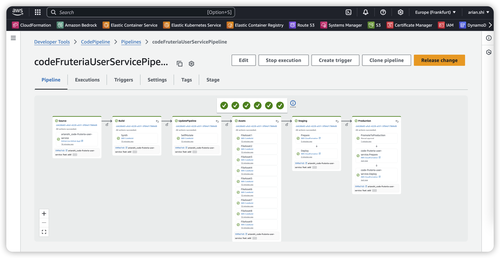

# code-fruteria-user-service

This is the backend service for the **Code Fruteria** project, responsible for user authentication, authorization, and user-related operations.

## 📐 Architecture

This service follows a modular structure, separating infrastructure code (CDK), business logic, and app handlers.

```
code-fruteria-user-service/
├── app/              # Lambda function logic and handlers
├── infra/            # AWS CDK infrastructure code
├── node_modules/
├── README.md
├── package.json
├── tsconfig.json
└── ...
```

## 🚀 Features

- AWS Lambda-based user services
- AWS CDK for infrastructure provisioning
- JWT-based authentication
- Modular architecture for easy scaling

## 🔄 CI/CD Pipeline

This project supports a fully automated CI/CD pipeline using AWS CDK Pipelines.

1. **Clone the repository**
   ```bash
   git@github.com:arianshi/code-fruteria-user-service.git
   cd code-fruteria-user-service
   ```
2. **Install dependencies**
   ```bash
   yarn
   ```
3. **Deploy the stack**
   ```bash
   npx cdk deploy code-fruteria-user-service
   ```

### 📦 Deployment Steps

1. Bootstrap your AWS environment (first time only):

   ```bash
   npx cdk bootstrap
   ```

2. Deploy the pipeline:

   ```bash
   npx cdk deploy code-fruteria-user-service-pipeline
   ```

3. Deploy the build project:

   ```bash
   npx cdk deploy code-fruteria-user-service-build
   ```


## 🌐 Production URL

Frontend App: [https://smartretailstore.net](https://smartretailstore.net)

## 🛠️ Tech Stack

- TypeScript
- AWS Lambda + API Gateway
- AWS CDK
- Amazon SSM, Cognito, DynamoDB (if applicable)

## 📦 Getting Started

1. Install dependencies:

   ```bash
   yarn install
   ```

2. Deploy infrastructure (CDK bootstrap may be required first):

   ```bash
   npx cdk deploy --all
   ```

3. Run tests:

   ```bash
   yarn test
   ```

## 🧪 Testing

Tests are written using [Jest](https://jestjs.io/) or Vitest, depending on setup. Ensure all logic in `app/` is covered.

## 📁 Environments

| Environment | Description      |
|-------------|------------------|
| dev         | Development environment|
| staging     | Staging environment|
| prod        | Production environment |

## 📄 License

MIT
